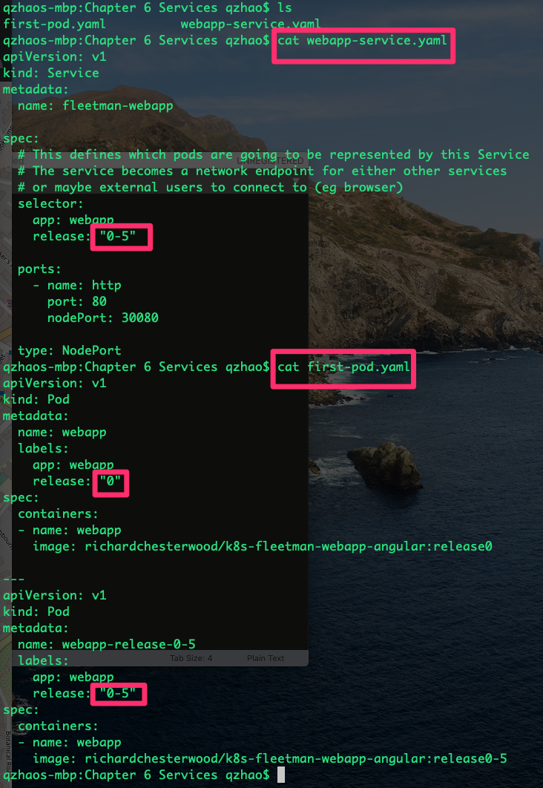
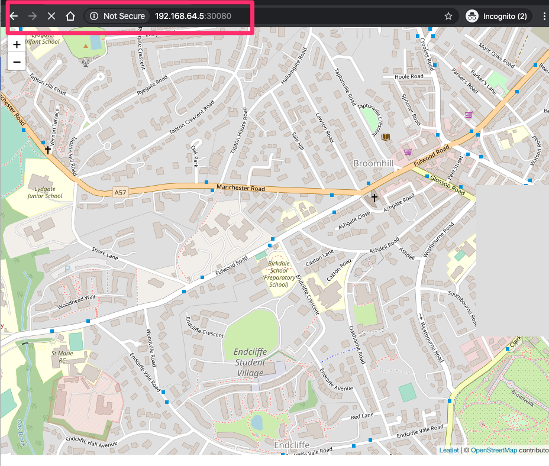
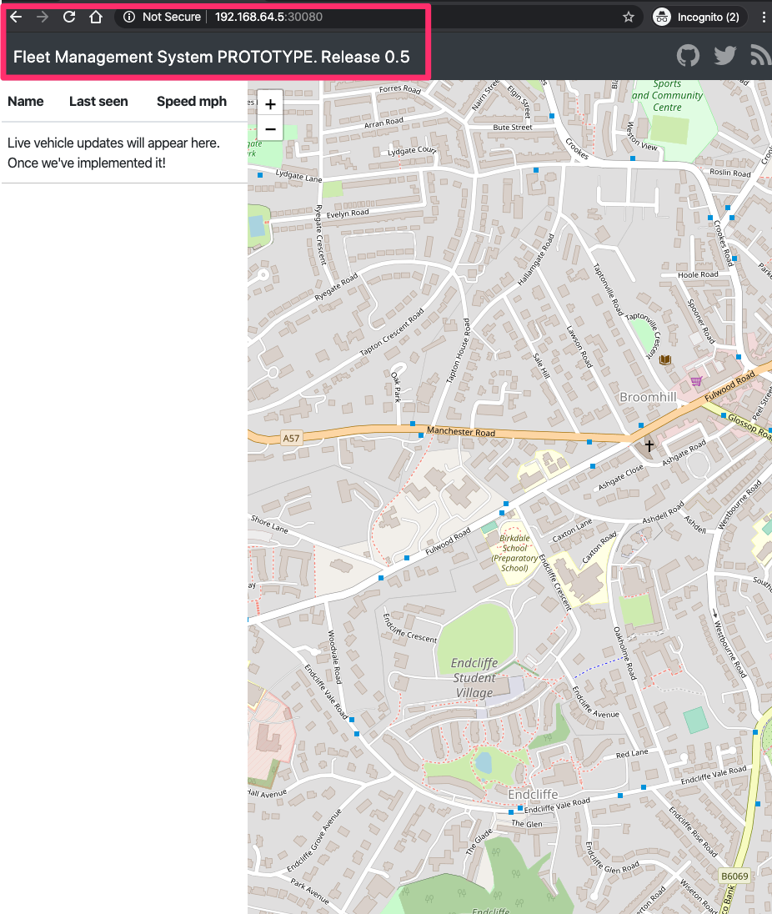

```
localhost:k8s-test zhao$ kubectl get all
localhost:k8s-test zhao$ kubectl apply -f first-pod.yaml
pod/webapp created
localhost:k8s-test zhao$ kubectl get all
```
this can not be accessed.
http://192.168.99.101
check detail info with the following command
```
kubectl describe pod webapp
localhost:k8s-test zhao$ kubectl exec webapp ls
localhost:k8s-test zhao$ kubectl -it exec webapp sh
/ # ls
/ # wget http://localhost:80
```

```
localhost:k8s-test zhao$ kubectl apply -f webapp-service.yaml
service/fleetman-webapp created
localhost:k8s-test zhao$ kubectl get all
```
```
localhost:k8s-test zhao$ minikube ip
192.168.99.102
```
This is not work
http://192.168.99.102:30080

After you add label in webapp-service.yaml and first-pod.yaml
and apply your change
```
localhost:k8s-test zhao$ kubectl apply -f webapp-service.yaml
localhost:k8s-test zhao$ kubectl apply -f first-pod.yaml
```
This will work
http://192.168.99.102:30080


----
```
k8s-course
kubectl get po
kubectl exec webapp ls
kubectl -it exec webapp sh
wget http://localhost:80


kubectl describe svc/fleetman-webapp
kubectl get po --show-labels
kubectl get po --show-labels -l release=0-5
```





