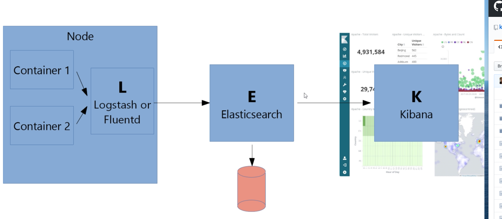
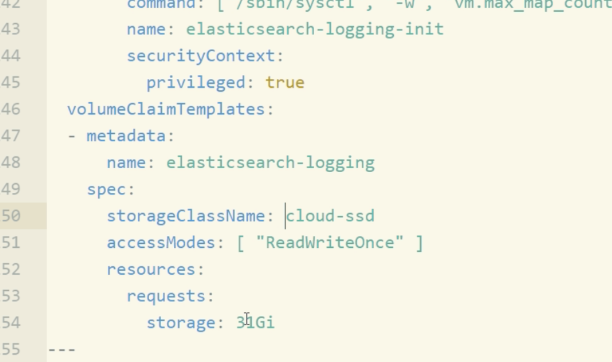

pls check the latest version in this link

** https://github.com/kubernetes/kubernetes/tree/master/cluster/addons/fluentd-elasticsearch

** fluentd-config.yaml and elastic-stack.yaml version is old, pls check the latest version in the following link.
pls do not forget to set your ssd-storage

```
volumeClaimTemplates:
  - metadata:
      name: elasticsearch-logging
    spec:
      storageClassName: cloud-ssd
      accessModes: [ "ReadWriteOnce" ]
      resources:
        requests:
          storage: 31Gi
```


---


---



