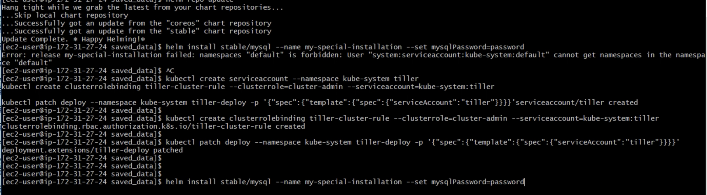
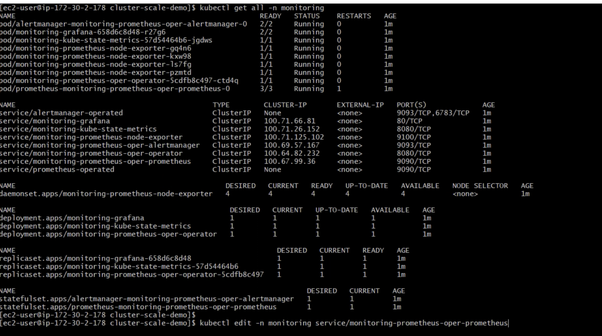
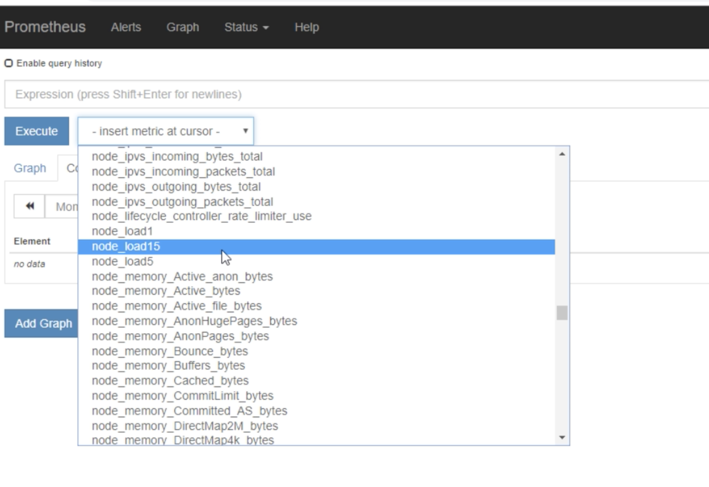

fix helm priviledges.txt
```


kubectl create serviceaccount --namespace kube-system tiller

kubectl create clusterrolebinding tiller-cluster-rule --clusterrole=cluster-admin --serviceaccount=kube-system:tiller

kubectl patch deploy --namespace kube-system tiller-deploy -p '{"spec":{"template":{"spec":{"serviceAccount":"tiller"}}}}' 


```



---
# prometheus-operator
edit ClusterIP to LoadBalancer



