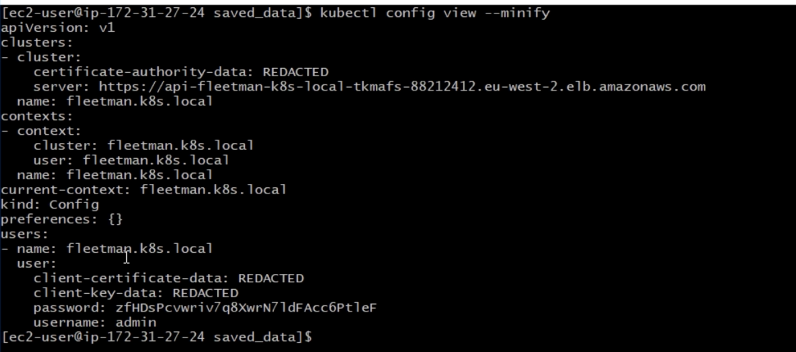
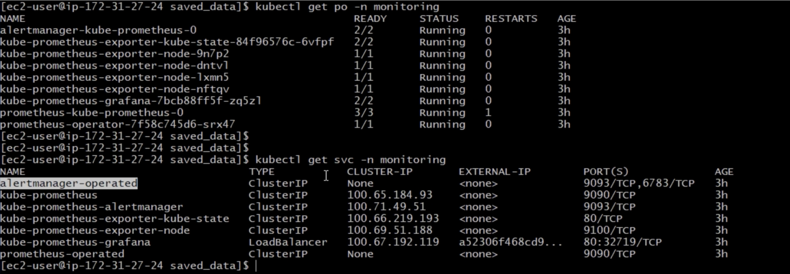
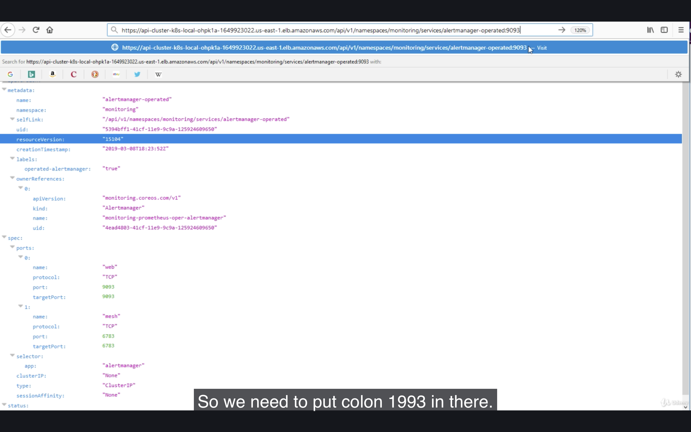
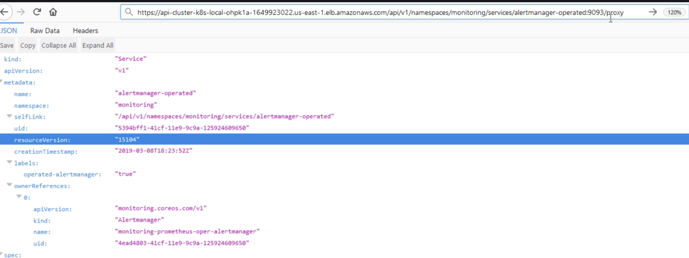
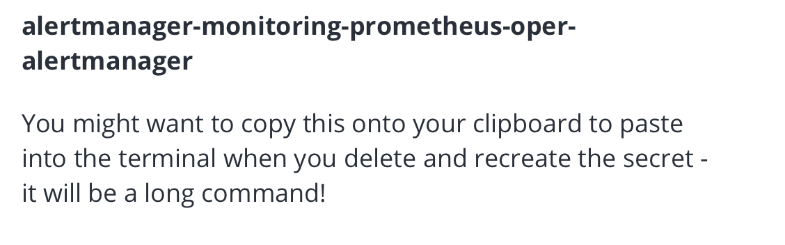
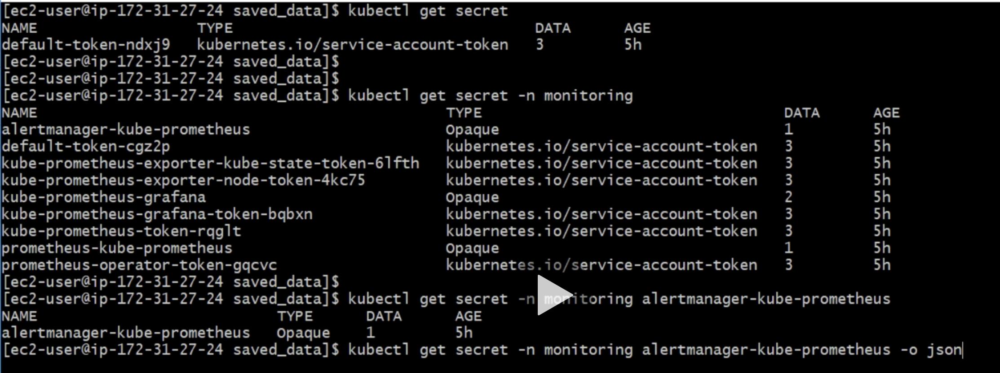
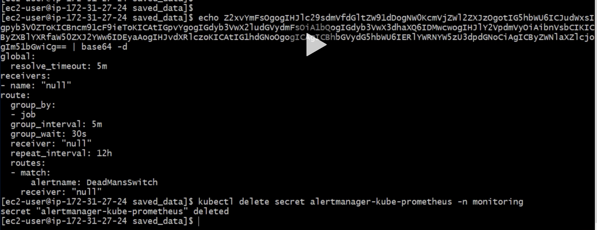
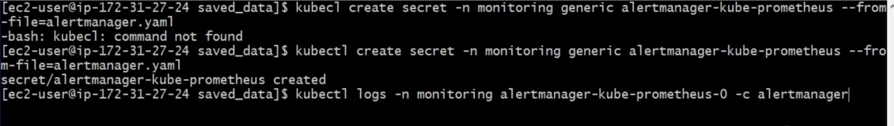

```
kubectl get po -n kube-system
kubectl get svc -n kube-system
kubectl describe svc kibana-logging -n kube-system
kubectl edit monitoring service/monitoring-prometheus-oper-prometheus
```

get alert manager's username/password
```
kubectl config vuew --minify
```
open alert manager URL
```
LB_URL/api/v1/namespaces/default/services/fleetman-api-gateway:8080/proxy/
```

```
kubectl get svc -n monitoring
```
```
kubectl logs -n monitoring alertmanager-kube-prometheus-0
kubectl logs -f -n monitoring alertmanager-kube-prometheus-0 -c alaertmanager
kubectl get secret
kubectl get secret -n monitoring
kubectl get secret -n monitoring alaertmanager-kube-prometheus
kubectl get secret -n monitoring alaertmanager-kube-prometheus -o json
echo ........ base64 | base64 -d
kubectl delete secret alertmanager-kube-prometheus -n monitoring
kubectl create secret -n monitoring generic alertmanager-kube-prometheus --from-file=alertmanager.yaml


```
---









