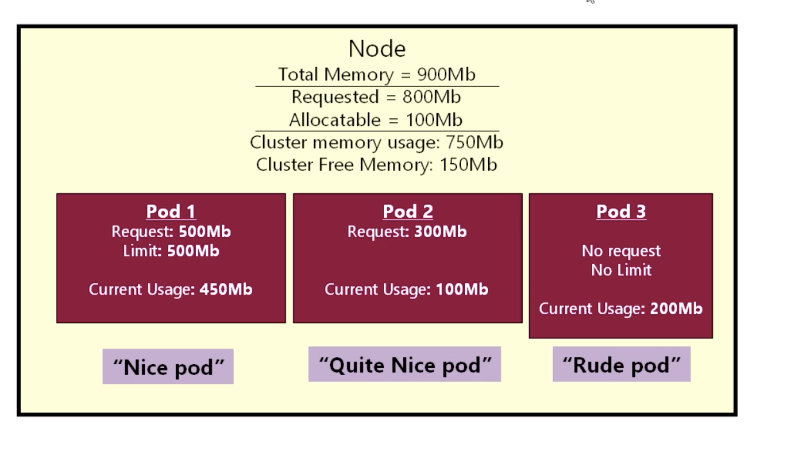
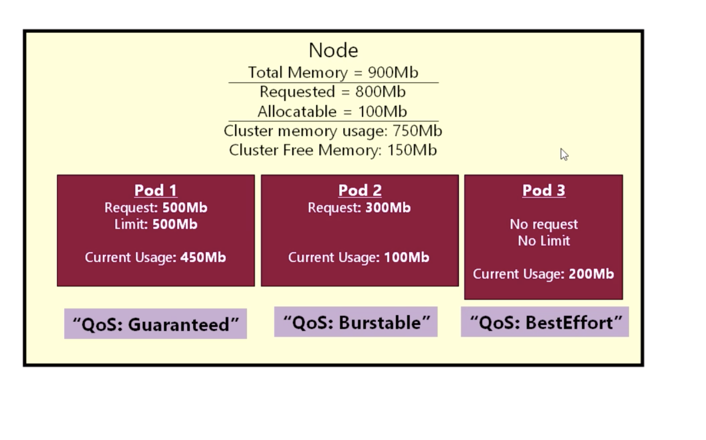
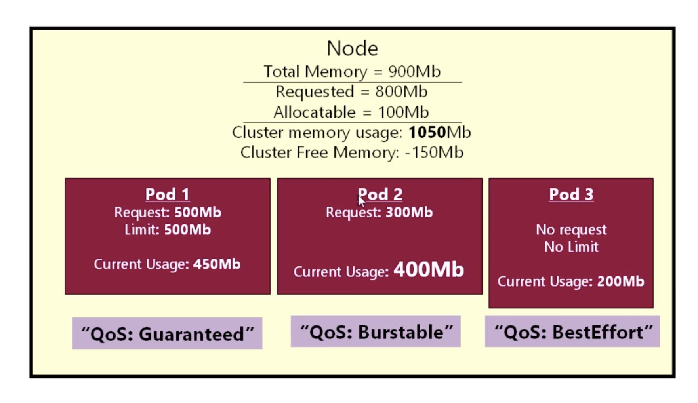
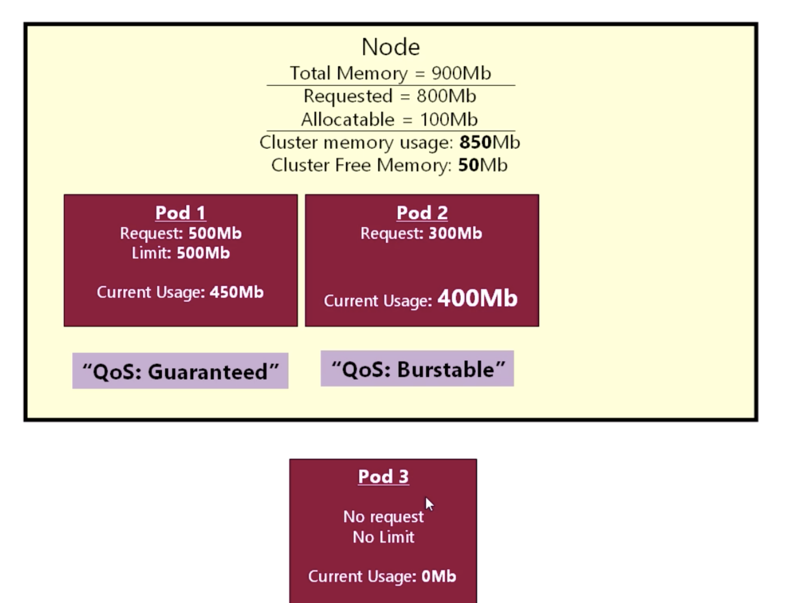
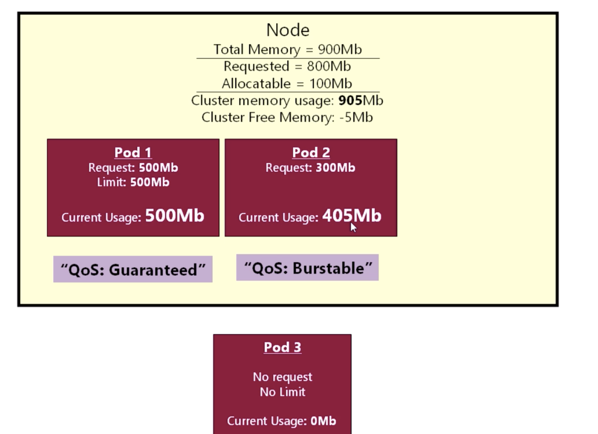
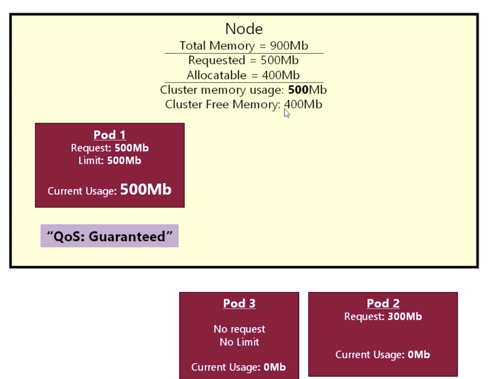
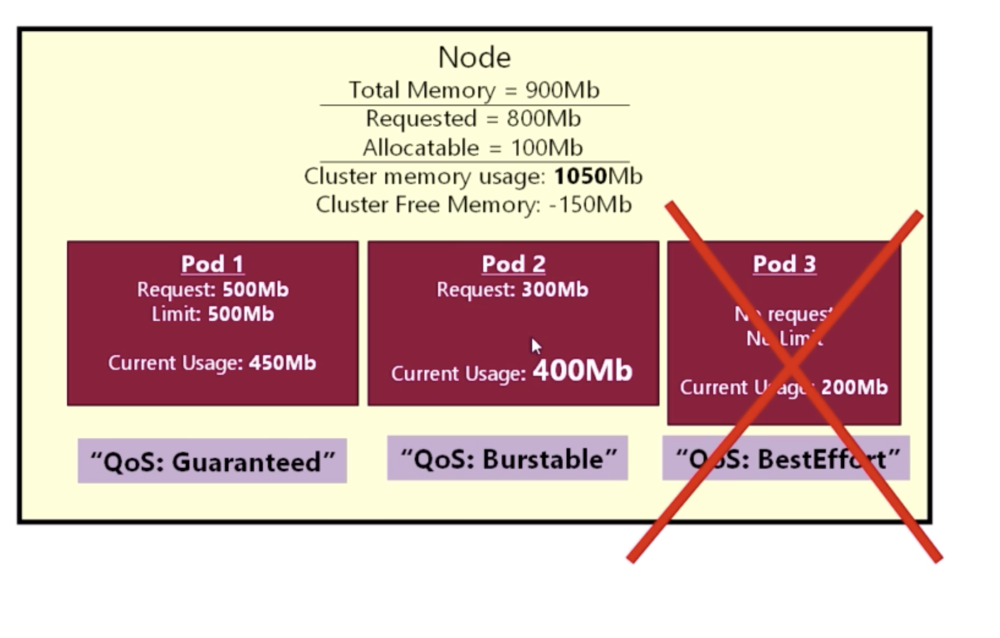
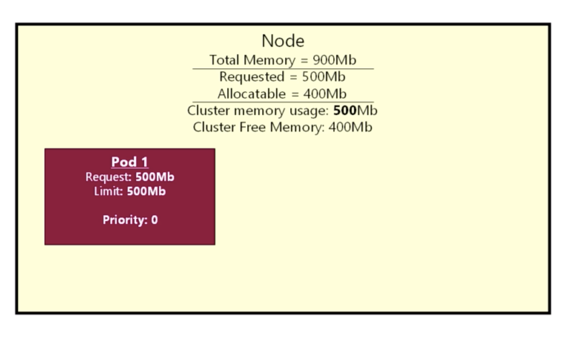
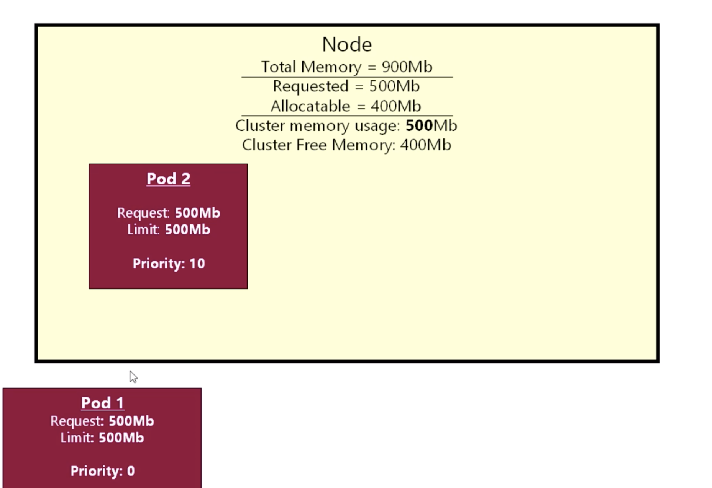

```
localhost:doc17 zhao$ kubectl describe pod queue-85758dd49b-dwzsr
Name:           queue-85758dd49b-dwzsr
Namespace:      default
Priority:       0
Node:           minikube/10.0.2.15
Start Time:     Wed, 24 Jul 2019 17:10:22 -0400
Labels:         app=queue
                pod-template-hash=85758dd49b
Annotations:    <none>
Status:         Running
IP:             172.17.0.13
Controlled By:  ReplicaSet/queue-85758dd49b
Containers:
  queue:
    Container ID:   docker://c09251a7f670e49f5f24480f6951f546f45ac1c0149c506b778df92a96fae731
    Image:          richardchesterwood/k8s-fleetman-queue:resources
    Image ID:       docker-pullable://richardchesterwood/k8s-fleetman-queue@sha256:7968190564be05b802480e95c2cd855004e8c69e1ad28b7334abc3075cf5a971
    Port:           <none>
    Host Port:      <none>
    State:          Running
      Started:      Wed, 24 Jul 2019 17:10:33 -0400
    Ready:          True
    Restart Count:  0
    Requests:
      cpu:        100m
      memory:     300Mi
    Environment:  <none>
    Mounts:
      /var/run/secrets/kubernetes.io/serviceaccount from default-token-n9pk7 (ro)
Conditions:
  Type              Status
  Initialized       True
  Ready             True
  ContainersReady   True
  PodScheduled      True
Volumes:
  default-token-n9pk7:
    Type:        Secret (a volume populated by a Secret)
    SecretName:  default-token-n9pk7
    Optional:    false
QoS Class:       Burstable
Node-Selectors:  <none>
Tolerations:     node.kubernetes.io/not-ready:NoExecute for 300s
                 node.kubernetes.io/unreachable:NoExecute for 300s
Events:
  Type    Reason     Age   From               Message
  ----    ------     ----  ----               -------
  Normal  Scheduled  42s   default-scheduler  Successfully assigned default/queue-85758dd49b-dwzsr to minikube
  Normal  Pulling    41s   kubelet, minikube  Pulling image "richardchesterwood/k8s-fleetman-queue:resources"
  Normal  Pulled     32s   kubelet, minikube  Successfully pulled image "richardchesterwood/k8s-fleetman-queue:resources"
  Normal  Created    32s   kubelet, minikube  Created container queue
  Normal  Started    31s   kubelet, minikube  Started container queue
```
```
localhost:doc17 zhao$ kubectl describe pod queue-774c7bcfcd-lfz7l
Name:           queue-774c7bcfcd-lfz7l
Namespace:      default
Priority:       0
Node:           minikube/10.0.2.15
Start Time:     Wed, 24 Jul 2019 17:18:12 -0400
Labels:         app=queue
                pod-template-hash=774c7bcfcd
Annotations:    <none>
Status:         Running
IP:             172.17.0.9
Controlled By:  ReplicaSet/queue-774c7bcfcd
Containers:
  queue:
    Container ID:   docker://10b959373b5cb44587a70fd117aa2ed5bf52de8e1437d21d4d9ae5eadb84e335
    Image:          richardchesterwood/k8s-fleetman-queue:resources
    Image ID:       docker-pullable://richardchesterwood/k8s-fleetman-queue@sha256:7968190564be05b802480e95c2cd855004e8c69e1ad28b7334abc3075cf5a971
    Port:           <none>
    Host Port:      <none>
    State:          Running
      Started:      Wed, 24 Jul 2019 17:18:13 -0400
    Ready:          True
    Restart Count:  0
    Limits:
      cpu:     100m
      memory:  300Mi
    Requests:
      cpu:        100m
      memory:     300Mi
    Environment:  <none>
    Mounts:
      /var/run/secrets/kubernetes.io/serviceaccount from default-token-n9pk7 (ro)
Conditions:
  Type              Status
  Initialized       True
  Ready             True
  ContainersReady   True
  PodScheduled      True
Volumes:
  default-token-n9pk7:
    Type:        Secret (a volume populated by a Secret)
    SecretName:  default-token-n9pk7
    Optional:    false
QoS Class:       Guaranteed
Node-Selectors:  <none>
Tolerations:     node.kubernetes.io/not-ready:NoExecute for 300s
                 node.kubernetes.io/unreachable:NoExecute for 300s
Events:
  Type    Reason     Age   From               Message
  ----    ------     ----  ----               -------
  Normal  Scheduled  64s   default-scheduler  Successfully assigned default/queue-774c7bcfcd-lfz7l to minikube
  Normal  Pulled     64s   kubelet, minikube  Container image "richardchesterwood/k8s-fleetman-queue:resources" already present on machine
  Normal  Created    64s   kubelet, minikube  Created container queue
  Normal  Started    63s   kubelet, minikube  Started container queue
```


Qos labels and Evictions







Pod priorities



---
kubectl describe node minikube
