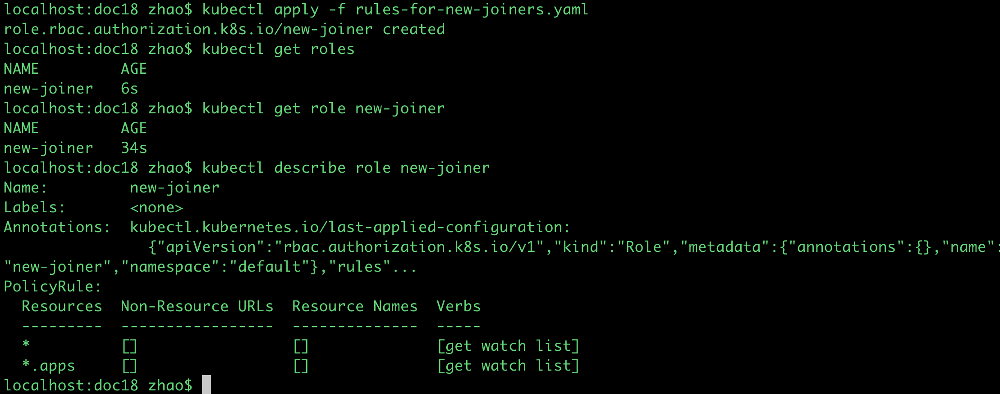

```
kubectl get po --watch

```
```
localhost:doc18 zhao$ kubectl apply -f rules-for-new-joiners.yaml
role.rbac.authorization.k8s.io/new-joiner created
localhost:doc18 zhao$ kubectl get roles
NAME         AGE
new-joiner   6s
localhost:doc18 zhao$ kubectl get role new-joiner
NAME         AGE
new-joiner   34s
localhost:doc18 zhao$ kubectl describe role new-joiner
Name:         new-joiner
Labels:       <none>
Annotations:  kubectl.kubernetes.io/last-applied-configuration:
                {"apiVersion":"rbac.authorization.k8s.io/v1","kind":"Role","metadata":{"annotations":{},"name":"new-joiner","namespace":"default"},"rules"...
PolicyRule:
  Resources  Non-Resource URLs  Resource Names  Verbs
  ---------  -----------------  --------------  -----
  *          []                 []              [get watch list]
  *.apps     []                 []              [get watch list]

```



```
localhost:doc18 zhao$ kubectl apply -f rules-for-new-joiners.yaml
role.rbac.authorization.k8s.io/new-joiner configured
rolebinding.rbac.authorization.k8s.io/put-specific-user-or-users-into-new-joiner-role created
localhost:doc18 zhao$ kubectl get rolebinding put-specific-user-or-users-into-new-joiner-role
NAME                                              AGE
put-specific-user-or-users-into-new-joiner-role   95s
localhost:doc18 zhao$ kubectl describe rolebinding put-specific-user-or-users-into-new-joiner-role
Name:         put-specific-user-or-users-into-new-joiner-role
Labels:       <none>
Annotations:  kubectl.kubernetes.io/last-applied-configuration:
                {"apiVersion":"rbac.authorization.k8s.io/v1","kind":"RoleBinding","metadata":{"annotations":{},"name":"put-specific-user-or-users-into-new...
Role:
  Kind:  Role
  Name:  new-joiner
Subjects:
  Kind  Name                      Namespace
  ----  ----                      ---------
  User  francis-linux-login-name
```
---
do the following things on AWS
```
kubectl get nodes
whoami
kubectl get all
sudo useradd francis-linux-login-name
ls /home
sudo passwd francis-linux-login-name
kubectl create ns playground
su - francis-linux-login-name
whoami
kubectl get all
exit current and login super user
kubectl config view
and exit super user to login francis-linux-login-name
kubectl config set-cluster fleetman.k8s.local --server=(url is from previous step)

```


```
kubectl config view
kubectl config set-context mycontext --user francis-linux-login-name --cluster fleetman.k8s.local
kubectl config view
```

```
kubectl config use-context mycontext
kubectl get all
```


```
openssl genrsa -out private-key-francis.key 2048
openssl req -new -key private-key-francis.key -out req.csr -subj "/CN=francis-linux-login-name/O=francis-linux-login-name"
vi req.csr
history | grep STATE
aws s3 ls
aws s3 ls s3://chesterwood-stat

```


---
allocating Access to Users


---
ClusterRoles and ClusterRoleBindings


- kind: Service


---


