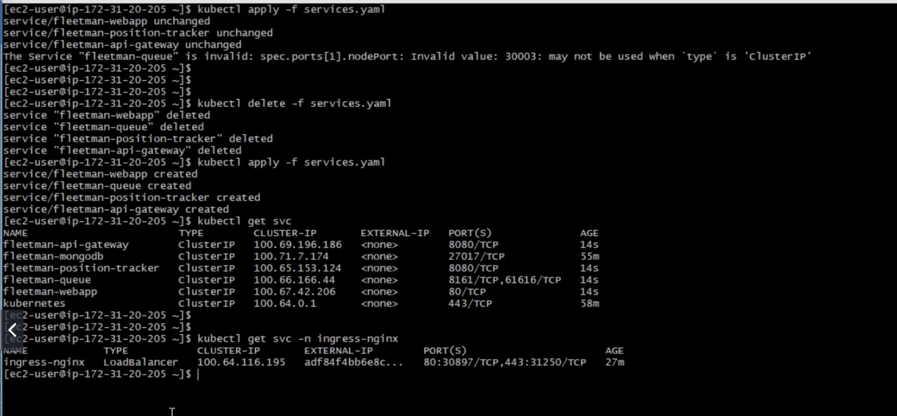

---
* https://kubernetes.github.io/ingress-nginx/deploy/#aws

---
http://192.168.99.106:30080
http://192.168.99.106:30010


```
localhost:doc20 zhao$ kubectl get svc
NAME                        TYPE        CLUSTER-IP      EXTERNAL-IP   PORT(S)                          AGE
fleetman-api-gateway        NodePort    10.100.44.246   <none>        8080:30020/TCP                   10d
fleetman-mongodb            ClusterIP   10.105.61.4     <none>        27017/TCP                        10d
fleetman-position-tracker   ClusterIP   10.106.80.156   <none>        8080/TCP                         10d
fleetman-queue              NodePort    10.97.14.19     <none>        8161:30010/TCP,61616:31975/TCP   10d
fleetman-webapp             NodePort    10.96.236.247   <none>        80:30080/TCP                     10d
kubernetes                  ClusterIP   10.96.0.1       <none>        443/TCP                          17d
localhost:doc20 zhao$
localhost:doc20 zhao$ minikube addons list
- addon-manager: enabled
- dashboard: enabled
- default-storageclass: enabled
- efk: disabled
- freshpod: disabled
- gvisor: disabled
- heapster: disabled
- ingress: disabled
- logviewer: disabled
- metrics-server: enabled
- nvidia-driver-installer: disabled
- nvidia-gpu-device-plugin: disabled
- registry: disabled
- registry-creds: disabled
- storage-provisioner: enabled
- storage-provisioner-gluster: disabled
localhost:doc20 zhao$ minikube addons enable ingress
✅  ingress was successfully enabled
localhost:doc20 zhao$ kubectl get po -n kube-system
NAME                                        READY   STATUS    RESTARTS   AGE
coredns-5c98db65d4-cqxrm                    1/1     Running   8          17d
coredns-5c98db65d4-qt9rf                    1/1     Running   8          17d
default-http-backend-59f7ff8999-tglxf       1/1     Running   0          53s
etcd-minikube                               1/1     Running   5          17d
kube-addon-manager-minikube                 1/1     Running   5          17d
kube-apiserver-minikube                     1/1     Running   5          17d
kube-controller-manager-minikube            1/1     Running   5          17d
kube-proxy-d2gnv                            1/1     Running   5          17d
kube-scheduler-minikube                     1/1     Running   6          17d
kubernetes-dashboard-7b8ddcb5d6-p8smd       1/1     Running   2          10d
metrics-server-84bb785897-m9dk4             1/1     Running   2          10d
nginx-ingress-controller-7b465d9cf8-snk9p   0/1     Running   0          52s
storage-provisioner                         1/1     Running   9          17d
localhost:doc20 zhao$ kubectl get svc --all-namespaces
NAMESPACE     NAME                        TYPE        CLUSTER-IP      EXTERNAL-IP   PORT(S)                          AGE
default       fleetman-api-gateway        NodePort    10.100.44.246   <none>        8080:30020/TCP                   10d
default       fleetman-mongodb            ClusterIP   10.105.61.4     <none>        27017/TCP                        10d
default       fleetman-position-tracker   ClusterIP   10.106.80.156   <none>        8080/TCP                         10d
default       fleetman-queue              NodePort    10.97.14.19     <none>        8161:30010/TCP,61616:31975/TCP   10d
default       fleetman-webapp             NodePort    10.96.236.247   <none>        80:30080/TCP                     10d
default       kubernetes                  ClusterIP   10.96.0.1       <none>        443/TCP                          17d
kube-system   default-http-backend        NodePort    10.106.120.63   <none>        80:30001/TCP                     3m11s
kube-system   kube-dns                    ClusterIP   10.96.0.10      <none>        53/UDP,53/TCP,9153/TCP           17d
kube-system   kubernetes-dashboard        ClusterIP   10.96.133.22    <none>        80/TCP                           10d
kube-system   metrics-server              ClusterIP   10.106.141.2    <none>        443/TCP                          10d
localhost:doc20 zhao$ minikube addons list
- addon-manager: enabled
- dashboard: enabled
- default-storageclass: enabled
- efk: disabled
- freshpod: disabled
- gvisor: disabled
- heapster: disabled
- ingress: enabled
- logviewer: disabled
- metrics-server: enabled
- nvidia-driver-installer: disabled
- nvidia-gpu-device-plugin: disabled
- registry: disabled
- registry-creds: disabled
- storage-provisioner: enabled
- storage-provisioner-gluster: disabled
localhost:doc20 zhao$ minikube addons disable dashboard
✅  dashboard was successfully disabled
localhost:doc20 zhao$ kubectl version
Client Version: version.Info{Major:"1", Minor:"15", GitVersion:"v1.15.0", GitCommit:"e8462b5b5dc2584fdcd18e6bcfe9f1e4d970a529", GitTreeState:"clean", BuildDate:"2019-06-20T04:49:16Z", GoVersion:"go1.12.6", Compiler:"gc", Platform:"darwin/amd64"}
Server Version: version.Info{Major:"1", Minor:"15", GitVersion:"v1.15.0", GitCommit:"e8462b5b5dc2584fdcd18e6bcfe9f1e4d970a529", GitTreeState:"clean", BuildDate:"2019-06-19T16:32:14Z", GoVersion:"go1.12.5", Compiler:"gc", Platform:"linux/amd64"}
localhost:etc zhao$ vi /etc/hosts
localhost:etc zhao$ sudo vi /etc/hosts
localhost:etc zhao$ cat /etc/hosts
##
# Host Database
#
# localhost is used to configure the loopback interface
# when the system is booting.  Do not change this entry.
##
127.0.0.1	localhost
255.255.255.255	broadcasthost
::1             localhost
#52.44.222.229   qa.mobile.operr.com
192.168.99.106 fleetman.com
```


fleetman.com is working well like the following screenshot


---
add queue.fleetman.com


https://kubernetes.github.io/ingress-nginx/
---
authentication

http://www.htaccesstools.com/htpasswd-generator/
admin/admin
put the following into auth
admin:$apr1$7P.RKp5K$KCvxUz1OZyenGN23GFHSd/

```
localhost:doc20 zhao$ kubectl create secret generic mycredentials --from-file auth
secret/mycredentials created
localhost:doc20 zhao$ kubectl get secret mycredentials -o yaml
apiVersion: v1
data:
  auth: YWRtaW46JGFwcjEkN1AuUktwNUskS0N2eFV6MU9aeWVuR04yM0dGSFNkLwo=
kind: Secret
metadata:
  creationTimestamp: "2019-07-26T20:23:44Z"
  name: mycredentials
  namespace: default
  resourceVersion: "284073"
  selfLink: /api/v1/namespaces/default/secrets/mycredentials
  uid: a8b043fd-def1-4504-926c-a14501785e1e
type: Opaque
localhost:doc20 zhao$
```

----
# ingress-public.yaml and ingress-secure.yaml
```
localhost:doc20 zhao$ kubectl delete ingress basic-routing
ingress.extensions "basic-routing" deleted
localhost:doc20 zhao$ kubectl apply -f ingress-public.yaml
ingress.extensions/public-routing created
localhost:doc20 zhao$ kubectl apply -f ingress-secure.yaml
ingress.extensions/secure-routing created
localhost:doc20 zhao$ kubectl describe ingress
Name:             public-routing
Namespace:        default
Address:
Default backend:  default-http-backend:80 (172.17.0.7:8080)
Rules:
  Host          Path  Backends
  ----          ----  --------
  fleetman.com
                /   fleetman-webapp:80 (172.17.0.5:80)
Annotations:
  kubectl.kubernetes.io/last-applied-configuration:  {"apiVersion":"extensions/v1beta1","kind":"Ingress","metadata":{"annotations":{},"name":"public-routing","namespace":"default"},"spec":{"rules":[{"host":"fleetman.com","http":{"paths":[{"backend":{"serviceName":"fleetman-webapp","servicePort":80},"path":"/"}]}}]}}

Events:
  Type    Reason  Age   From                      Message
  ----    ------  ----  ----                      -------
  Normal  CREATE  28s   nginx-ingress-controller  Ingress default/public-routing


Name:             secure-routing
Namespace:        default
Address:
Default backend:  default-http-backend:80 (172.17.0.7:8080)
Rules:
  Host                Path  Backends
  ----                ----  --------
  queue.fleetman.com
                      /   fleetman-queue:8161 (172.17.0.9:8161)
Annotations:
  nginx.ingress.kubernetes.io/auth-realm:            Get lost unless you have a password
  nginx.ingress.kubernetes.io/auth-secret:           mycredentials
  nginx.ingress.kubernetes.io/auth-type:             basic
  kubectl.kubernetes.io/last-applied-configuration:  {"apiVersion":"extensions/v1beta1","kind":"Ingress","metadata":{"annotations":{"nginx.ingress.kubernetes.io/auth-realm":"Get lost unless you have a password","nginx.ingress.kubernetes.io/auth-secret":"mycredentials","nginx.ingress.kubernetes.io/auth-type":"basic"},"name":"secure-routing","namespace":"default"},"spec":{"rules":[{"host":"queue.fleetman.com","http":{"paths":[{"backend":{"serviceName":"fleetman-queue","servicePort":8161},"path":"/"}]}}]}}

Events:
  Type    Reason  Age   From                      Message
  ----    ------  ----  ----                      -------
  Normal  CREATE  23s   nginx-ingress-controller  Ingress default/secure-routing
localhost:doc20 zhao$
```
---
# on AWS
https://kubernetes.github.io/ingress-nginx/deploy/#aws

```
wget https://raw.githubusercontent.com/kubernetes/ingress-nginx/master/deploy/static/mandatory.yaml
kubectl apply -f mandatory.yaml
kubectl get all -n ingress-nginx
wget https://raw.githubusercontent.com/kubernetes/ingress-nginx/master/deploy/static/provider/aws/service-l4.yaml
wget https://raw.githubusercontent.com/kubernetes/ingress-nginx/master/deploy/static/provider/aws/patch-configmap-l4.yaml
kubectl apply -f service-l4.yaml
kubectl apply -f patch-configmap-l4.yaml
kubectl get all -n ingress-nginx
```


check how minikube did on local

and copy it to AWS

and apply basic-auth-credentials.yaml

check all and modify services.yaml

change LoadBalancer to ClusterIP in the following image


```
kubectl apply -f services.yaml
```



check the following url that is from AWS


# set namespace as kube-system for monitor/alert
# watchdog
# prometheus

# setting up HTTPS with TLS termination at the load balancer
https://www.youtube.com/watch?v=gEzCKNA-nCg&feature=youtu.be
