# Jobs

```
localhost:doc21 zhao$ kubectl apply -f job.yaml
pod/test-job created
localhost:doc21 zhao$ kubectl get po
NAME                                READY   STATUS    RESTARTS   AGE
api-gateway-77dff9778b-5cdss        1/1     Running   0          3m49s
mongodb-5dc79669d-tlm7s             1/1     Running   0          3m49s
position-simulator-f67fd6ff-hmrh2   1/1     Running   0          3m49s
position-tracker-f6f5dd79d-wfxxb    1/1     Running   0          3m48s
queue-8b577ccc6-4xgzj               1/1     Running   0          3m48s
test-job                            1/1     Running   0          68s
webapp-7bf85bf85f-mrxqs             1/1     Running   0          3m48s
localhost:doc21 zhao$ watch kubectl get po
localhost:doc21 zhao$ kubectl get po
NAME                                READY   STATUS             RESTARTS   AGE
api-gateway-77dff9778b-5cdss        1/1     Running            0          28m
mongodb-5dc79669d-tlm7s             1/1     Running            0          28m
position-simulator-f67fd6ff-hmrh2   1/1     Running            0          28m
position-tracker-f6f5dd79d-wfxxb    1/1     Running            0          28m
queue-8b577ccc6-4xgzj               1/1     Running            0          28m
test-job                            0/1     CrashLoopBackOff   8          26m
webapp-7bf85bf85f-mrxqs             1/1     Running            0          28m
localhost:doc21 zhao$ watch kubectl get po test-job
localhost:doc21 zhao$ kubectl delete po test-job
pod "test-job" deleted
localhost:doc21 zhao$ kubectl apply -f .
pod/test-job created
localhost:doc21 zhao$ watch kubectl get po test-job
localhost:doc21 zhao$ kubectl logs test-job
starting
done
```
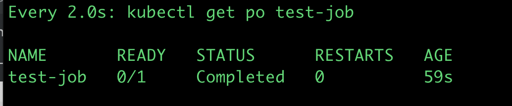
```
localhost:pems zhao$ minikube docker-env
export DOCKER_TLS_VERIFY="1"
export DOCKER_HOST="tcp://192.168.99.106:2376"
export DOCKER_CERT_PATH="/Users/zhao/.minikube/certs"
# Run this command to configure your shell:
# eval $(minikube docker-env)
```

```
localhost:doc21 zhao$ kubectl apply -f .
job.batch/test-job created
localhost:doc21 zhao$ watch kubectl get jobs test-job
localhost:doc21 zhao$ kubectl describe job test-job
Name:           test-job
Namespace:      default
Selector:       controller-uid=84ce9d14-5f25-4e2e-a5cd-4c417813eff0
Labels:         controller-uid=84ce9d14-5f25-4e2e-a5cd-4c417813eff0
                job-name=test-job
Annotations:    kubectl.kubernetes.io/last-applied-configuration:
                  {"apiVersion":"batch/v1","kind":"Job","metadata":{"annotations":{},"name":"test-job","namespace":"default"},"spec":{"backoffLimit":2,"temp...
Parallelism:    1
Completions:    1
Start Time:     Sun, 28 Jul 2019 12:20:33 -0400
Completed At:   Sun, 28 Jul 2019 12:21:05 -0400
Duration:       32s
Pods Statuses:  0 Running / 1 Succeeded / 0 Failed
Pod Template:
  Labels:  controller-uid=84ce9d14-5f25-4e2e-a5cd-4c417813eff0
           job-name=test-job
  Containers:
   long-job:
    Image:      python
    Port:       <none>
    Host Port:  <none>
    Command:
      python
    Args:
      -c
      import time;print('starting');time.sleep(30);print('done')
    Environment:  <none>
    Mounts:       <none>
  Volumes:        <none>
Events:
  Type    Reason            Age    From            Message
  ----    ------            ----   ----            -------
  Normal  SuccessfulCreate  2m11s  job-controller  Created pod: test-job-zdzck
```
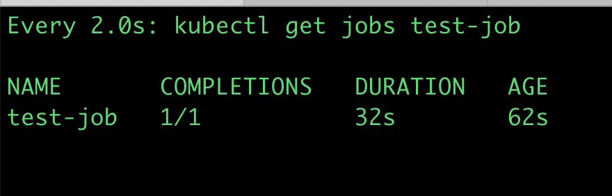
```
localhost:doc21 zhao$ kubectl get po
NAME                                READY   STATUS      RESTARTS   AGE
api-gateway-77dff9778b-5cdss        1/1     Running     0          49m
mongodb-5dc79669d-tlm7s             1/1     Running     0          49m
position-simulator-f67fd6ff-hmrh2   1/1     Running     0          49m
position-tracker-f6f5dd79d-wfxxb    1/1     Running     0          49m
queue-8b577ccc6-4xgzj               1/1     Running     0          49m
test-job-zdzck                      0/1     Completed   0          2m52s
webapp-7bf85bf85f-mrxqs             1/1     Running     0          49m
localhost:doc21 zhao$ kubectl get po test-job-zdzck
NAME             READY   STATUS      RESTARTS   AGE
test-job-zdzck   0/1     Completed   0          3m5s
localhost:doc21 zhao$ kubectl logs test-job-zdzck
starting
done
localhost:doc21 zhao$
localhost:doc21 zhao$ kubectl delete job --all
job.batch "test-job" deleted

```

```
localhost:doc21 zhao$ kubectl describe job test-job
Name:           test-job
Namespace:      default
Selector:       controller-uid=8aa52e35-8fc1-4db7-9ec3-73a22b8a2cdd
Labels:         controller-uid=8aa52e35-8fc1-4db7-9ec3-73a22b8a2cdd
                job-name=test-job
Annotations:    kubectl.kubernetes.io/last-applied-configuration:
                  {"apiVersion":"batch/v1","kind":"Job","metadata":{"annotations":{},"name":"test-job","namespace":"default"},"spec":{"backoffLimit":2,"temp...
Parallelism:    1
Completions:    1
Start Time:     Sun, 28 Jul 2019 12:35:11 -0400
Completed At:   Sun, 28 Jul 2019 12:37:56 -0400
Duration:       2m45s
Pods Statuses:  0 Running / 1 Succeeded / 2 Failed
Pod Template:
  Labels:  controller-uid=8aa52e35-8fc1-4db7-9ec3-73a22b8a2cdd
           job-name=test-job
  Containers:
   long-job:
    Image:      python
    Port:       <none>
    Host Port:  <none>
    Command:
      python
    Args:
      -c
      import time;print('starting');time.sleep(100);print('done')
    Environment:  <none>
    Mounts:       <none>
  Volumes:        <none>
Events:
  Type    Reason            Age    From            Message
  ----    ------            ----   ----            -------
  Normal  SuccessfulCreate  3m59s  job-controller  Created pod: test-job-k2wrp
  Normal  SuccessfulCreate  3m28s  job-controller  Created pod: test-job-v8jcw
  Normal  SuccessfulCreate  2m57s  job-controller  Created pod: test-job-29zsg
localhost:doc21 zhao$
```
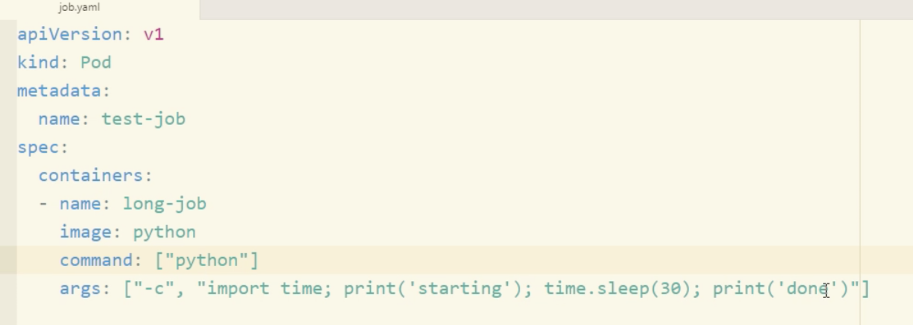
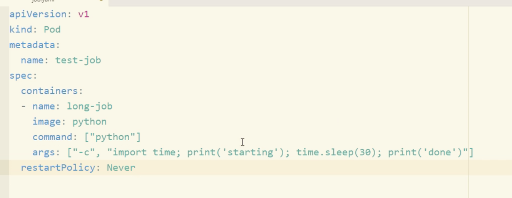
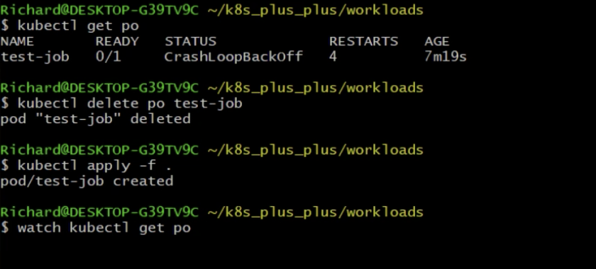
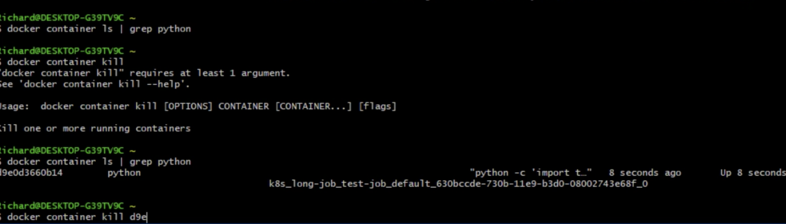
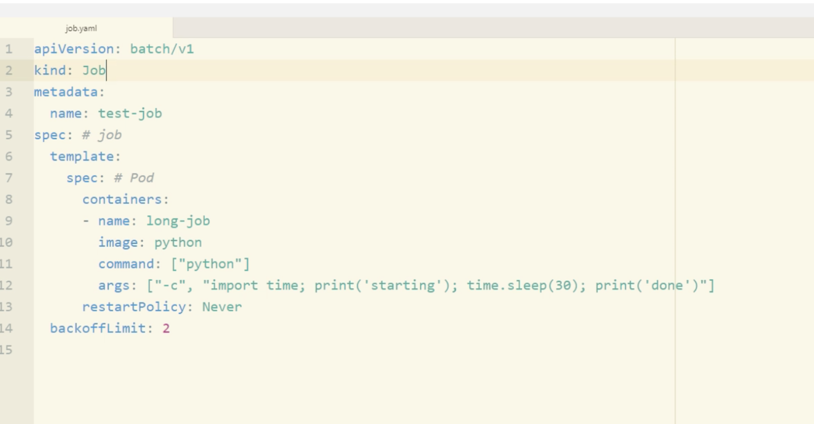
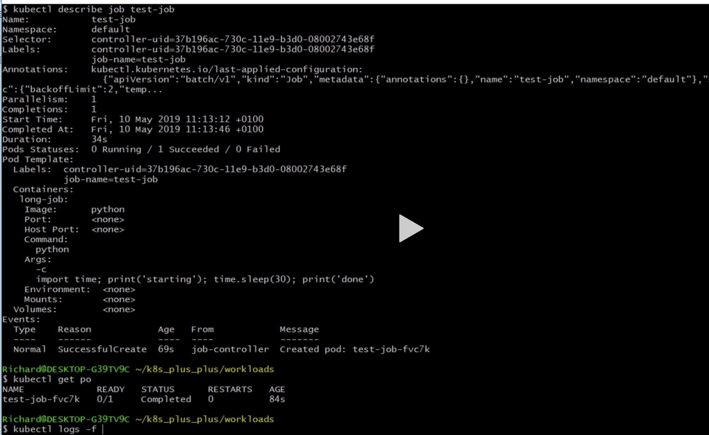
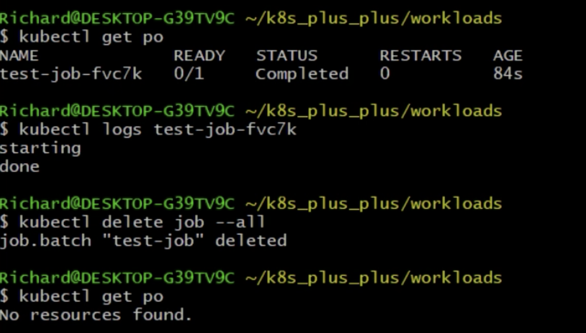
---
# CronJobs
https://crontab.guru/
```
localhost:doc21 zhao$ kubectl get cronjob
NAME       SCHEDULE    SUSPEND   ACTIVE   LAST SCHEDULE   AGE
cron-job   * * * * *   False     0        64s             3m39s
localhost:doc21 zhao$ kubectl describe cronjob cron-job
Name:                          cron-job
Namespace:                     default
Labels:                        <none>
Annotations:                   kubectl.kubernetes.io/last-applied-configuration:
                                 {"apiVersion":"batch/v1beta1","kind":"CronJob","metadata":{"annotations":{},"name":"cron-job","namespace":"default"},"spec":{"jobTemplate"...
Schedule:                      * * * * *
Concurrency Policy:            Allow
Suspend:                       False
Successful Job History Limit:  3
Failed Job History Limit:      1
Starting Deadline Seconds:     <unset>
Selector:                      <unset>
Parallelism:                   <unset>
Completions:                   <unset>
Pod Template:
  Labels:  <none>
  Containers:
   long-job:
    Image:      python:rc-slim
    Port:       <none>
    Host Port:  <none>
    Command:
      python
    Args:
      -c
      import time; print('starting'); time.sleep(30); print('done')
    Environment:     <none>
    Mounts:          <none>
  Volumes:           <none>
Last Schedule Time:  Sun, 28 Jul 2019 13:48:00 -0400
Active Jobs:         cron-job-1564336080
Events:
  Type    Reason            Age    From                Message
  ----    ------            ----   ----                -------
  Normal  SuccessfulCreate  3m24s  cronjob-controller  Created job cron-job-1564335900
  Normal  SawCompletedJob   2m34s  cronjob-controller  Saw completed job: cron-job-1564335900, status: Complete
  Normal  SuccessfulCreate  2m24s  cronjob-controller  Created job cron-job-1564335960
  Normal  SawCompletedJob   104s   cronjob-controller  Saw completed job: cron-job-1564335960, status: Complete
  Normal  SuccessfulCreate  84s    cronjob-controller  Created job cron-job-1564336020
  Normal  SawCompletedJob   44s    cronjob-controller  Saw completed job: cron-job-1564336020, status: Complete
  Normal  SuccessfulCreate  24s    cronjob-controller  Created job cron-job-1564336080
localhost:doc21 zhao$
localhost:doc21 zhao$ kubectl delete cronjob cron-job
cronjob.batch "cron-job" deleted
```
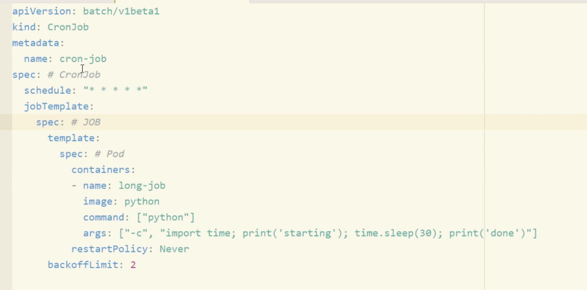
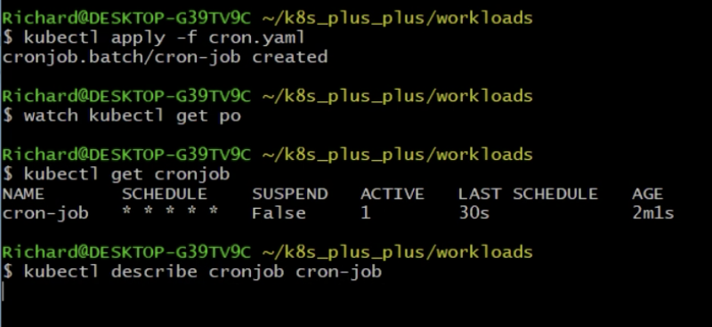
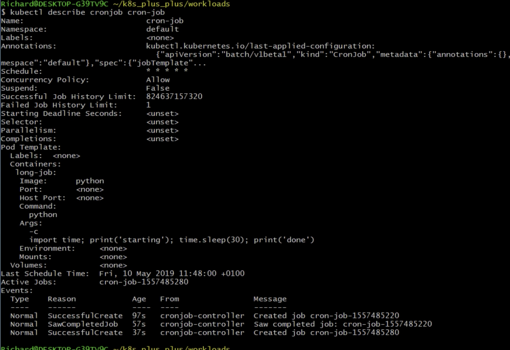
---
# DaemonSets

delete daemonset
```
localhost:doc21 zhao$ kubectl delete daemonset.apps/webapp --cascade=false
 localhost:doc21 zhao$ kubectl delete pod/webapp-l6gmq --grace-period=0 --force
```
---
# StatefulSets
```
ocalhost:doc21 zhao$ kubectl apply -f mongo-replicated.yaml
service/mongo created
statefulset.apps/mongo created
clusterrolebinding.rbac.authorization.k8s.io/default-view created
localhost:doc21 zhao$ kubectl get po
NAME      READY   STATUS              RESTARTS   AGE
mongo-0   0/2     ContainerCreating   0          29s
localhost:doc21 zhao$ watch kubectl get po
```
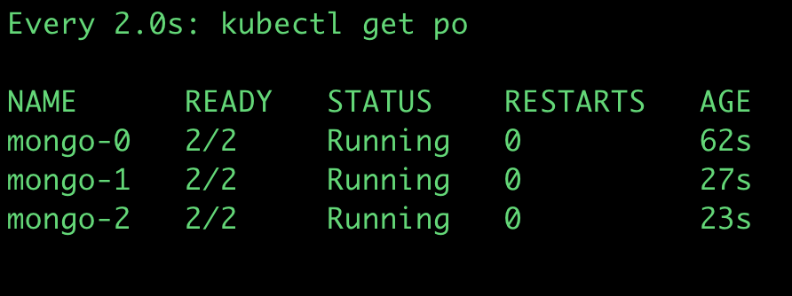
```
localhost:doc21 zhao$ kubectl get pvc
NAME                               STATUS   VOLUME                                     CAPACITY   ACCESS MODES   STORAGECLASS     AGE
mongo-persistent-storage-mongo-0   Bound    pvc-cf459180-a276-4a35-897e-ec4dd2e096b5   7Gi        RWO            standard         2m51s
mongo-persistent-storage-mongo-1   Bound    pvc-f4cdcb36-4410-4f4d-bb0f-26349bf0ea04   7Gi        RWO            standard         2m16s
mongo-persistent-storage-mongo-2   Bound    pvc-5d13f866-b691-4154-b2a9-80f86c94419a   7Gi        RWO            standard         2m12s
mongo-pvc                          Bound    local-storage                              20Gi       RWO            mylocalstorage   12d
localhost:doc21 zhao$
localhost:doc21 zhao$ kubectl get po
NAME      READY   STATUS    RESTARTS   AGE
mongo-0   2/2     Running   0          3m18s
mongo-1   2/2     Running   0          2m43s
mongo-2   2/2     Running   0          2m39s
localhost:doc21 zhao$ kubectl get all
NAME          READY   STATUS    RESTARTS   AGE
pod/mongo-0   2/2     Running   0          9m54s
pod/mongo-1   2/2     Running   0          9m19s
pod/mongo-2   2/2     Running   0          9m15s


NAME                 TYPE        CLUSTER-IP   EXTERNAL-IP   PORT(S)     AGE
service/kubernetes   ClusterIP   10.96.0.1    <none>        443/TCP     14m
service/mongo        ClusterIP   None         <none>        27017/TCP   9m55s


NAME                     READY   AGE
statefulset.apps/mongo   3/3     9m54s
localhost:doc21 zhao$ kubectl apply -f services.yaml
service/fleetman-webapp created
service/fleetman-queue created
service/fleetman-position-tracker created
service/fleetman-api-gateway created
localhost:doc21 zhao$ kubectl apply -f workloads.yaml
deployment.apps/queue created
deployment.apps/position-simulator created
deployment.apps/position-tracker created
deployment.apps/api-gateway created
daemonset.apps/webapp created
localhost:doc21 zhao$
localhost:doc21 zhao$ kubectl get po
NAME                                 READY   STATUS    RESTARTS   AGE
api-gateway-77dff9778b-w26hj         1/1     Running   0          18s
mongo-0                              2/2     Running   0          10m
mongo-1                              2/2     Running   0          10m
mongo-2                              2/2     Running   0          10m
position-simulator-96f46d659-kfzqt   1/1     Running   0          18s
position-tracker-95dcf9bf9-j4jzl     1/1     Running   0          18s
queue-8b577ccc6-2zvhq                1/1     Running   0          18s
webapp-gfr5g                         1/1     Running   0          18s
localhost:doc21 zhao$
localhost:doc21 zhao$ kubectl logs -f position-tracker-95dcf9bf9-j4jzl
```
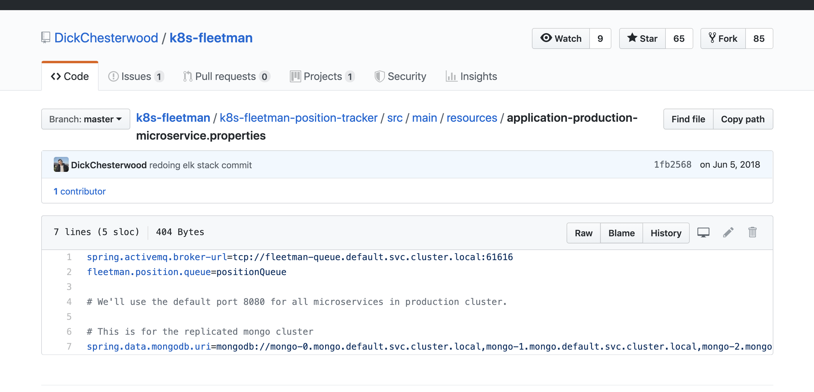
* manually kill mongo0
```
kubectl delete po mongo-0
```


---
# ReplicaSets, Deployments pretty much the same thing.
```
kubectl delete rs --all
kubectl delete svc --all
kubectl delete deployments --all
```
---
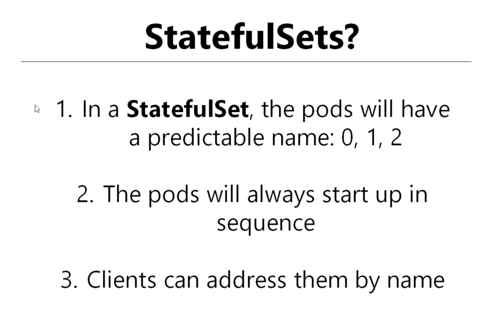
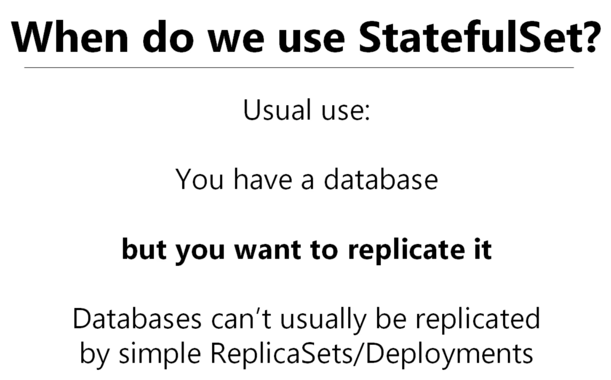
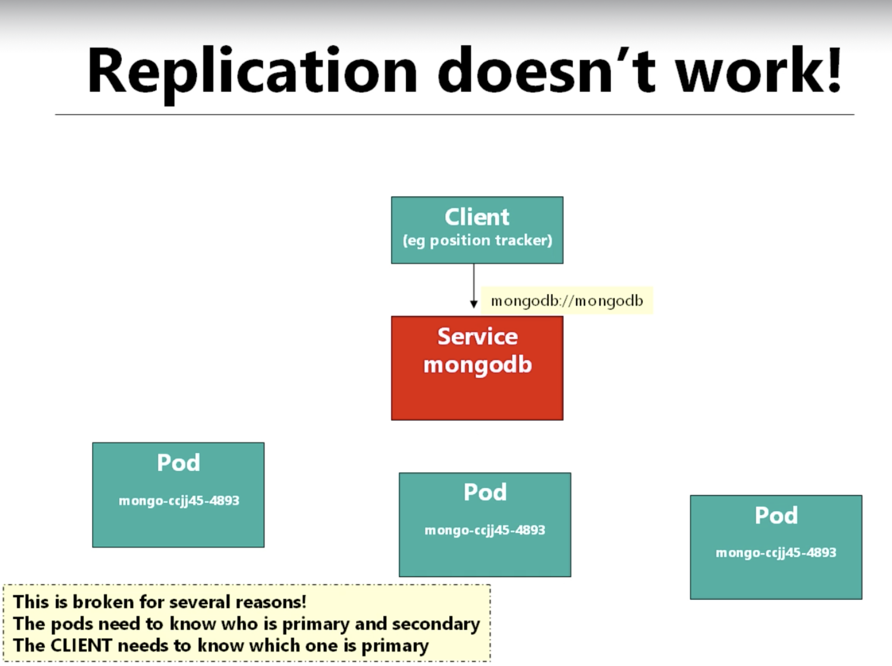
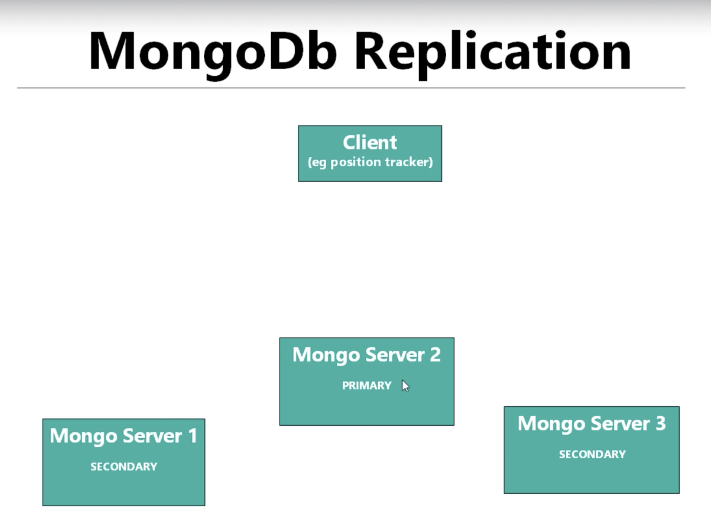
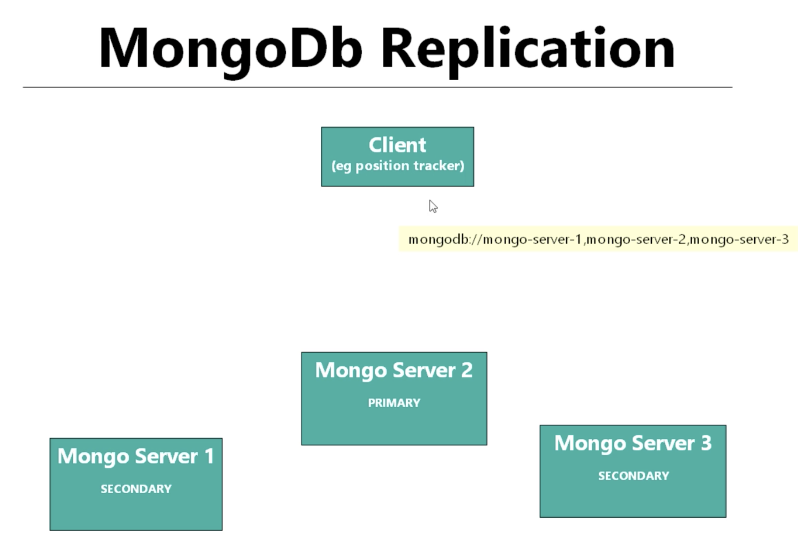
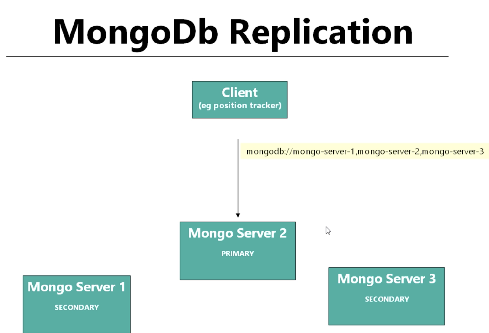
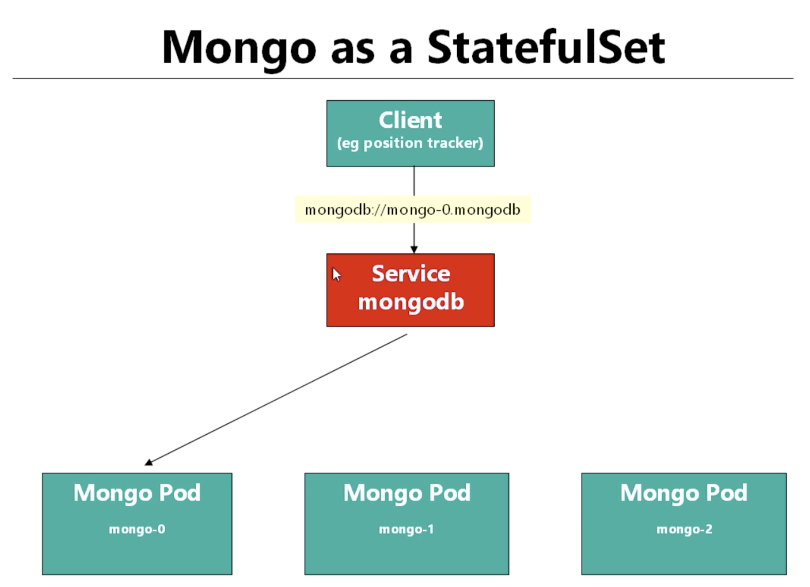
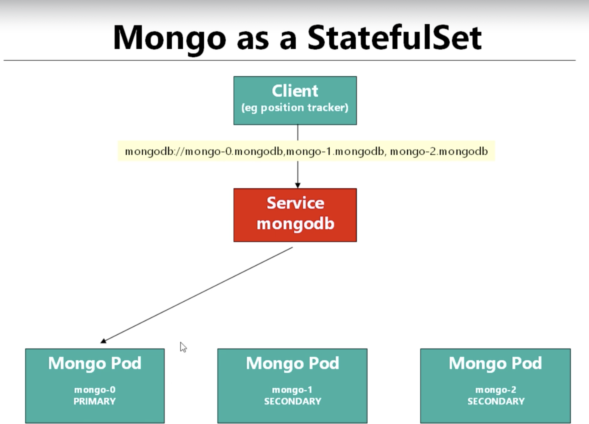
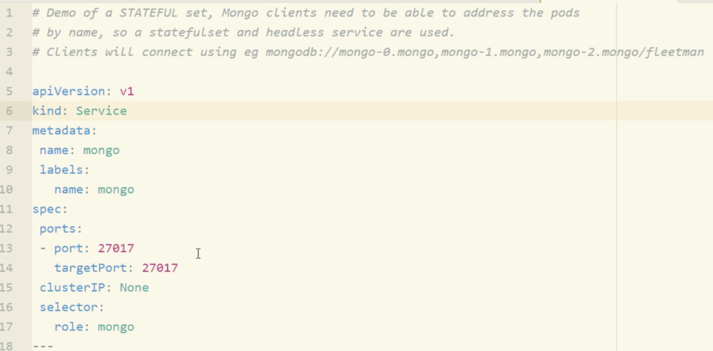
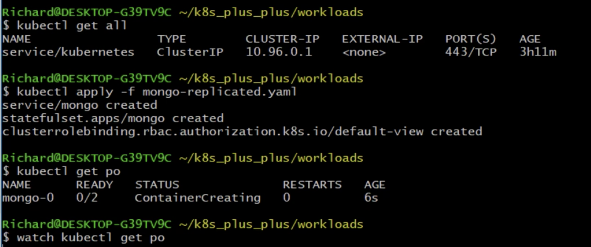
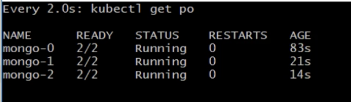
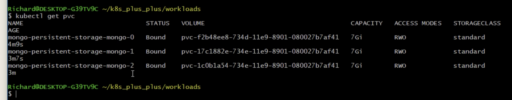
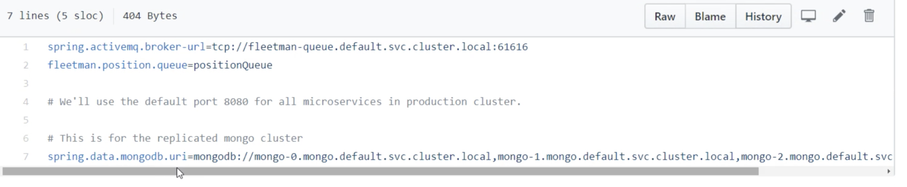
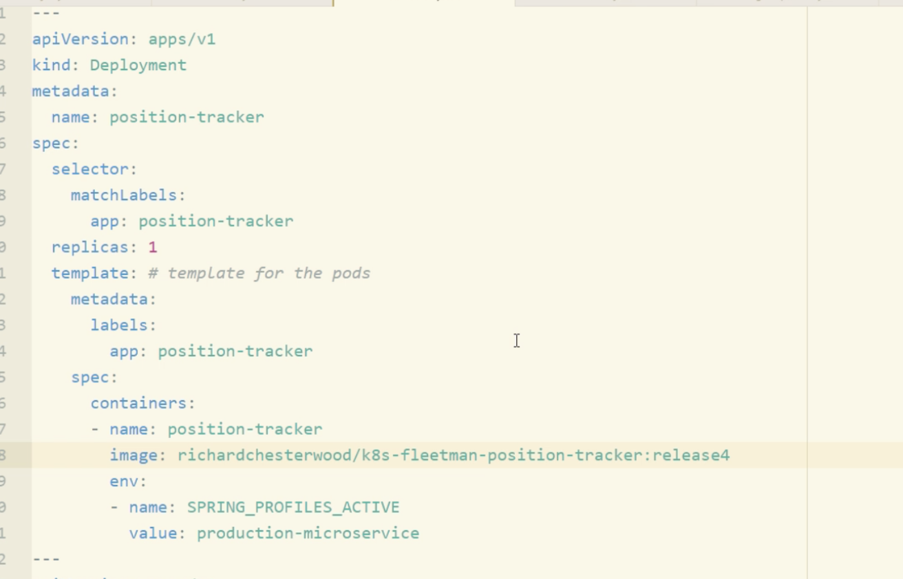
