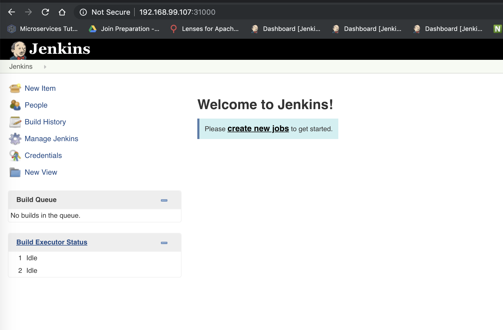
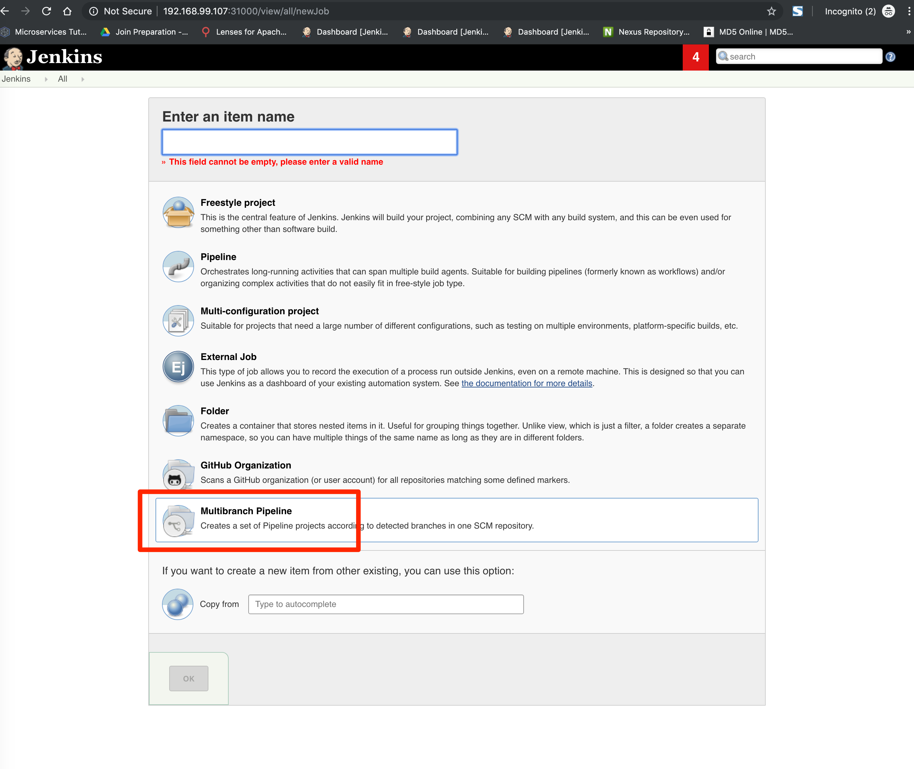

# CI-CD
```
localhost:doc22 zhao$ minikube delete
🔥  Deleting "minikube" from virtualbox ...
💔  The "minikube" cluster has been deleted.
localhost:doc22 zhao$ minikube start --memory 4096
localhost:doc22 zhao$ mkdir ci-cd-demo
localhost:doc22 zhao$ cd ci-cd-demo/
localhost:ci-cd-demo zhao$ git clone https://github.com/new-cherry-inc/jenkins.git
localhost:jenkins zhao$ docker image ls
localhost:jenkins zhao$ minikube docker-env
export DOCKER_TLS_VERIFY="1"
export DOCKER_HOST="tcp://192.168.99.107:2376"
export DOCKER_CERT_PATH="/Users/zhao/.minikube/certs"
# Run this command to configure your shell:
# eval $(minikube docker-env)
localhost:jenkins zhao$ eval $(minikube docker-env)
localhost:jenkins zhao$ export DOCKER_TLS_VERIFY="1"
localhost:jenkins zhao$ export DOCKER_HOST="tcp://192.168.99.107:2376"
localhost:jenkins zhao$ export DOCKER_CERT_PATH="/Users/zhao/.minikube/certs"
localhost:jenkins zhao$ docker image ls
REPOSITORY                                                       TAG                 IMAGE ID            CREATED             SIZE
k8s.gcr.io/kube-proxy                                            v1.15.0             d235b23c3570        5 weeks ago         82.4MB
k8s.gcr.io/kube-apiserver                                        v1.15.0             201c7a840312        5 weeks ago         207MB
k8s.gcr.io/kube-controller-manager                               v1.15.0             8328bb49b652        5 weeks ago         159MB
k8s.gcr.io/kube-scheduler                                        v1.15.0             2d3813851e87        5 weeks ago         81.1MB
quay.io/kubernetes-ingress-controller/nginx-ingress-controller   0.23.0              42d47fe0c78f        5 months ago        591MB
k8s.gcr.io/kube-addon-manager                                    v9.0                119701e77cbc        6 months ago        83.1MB
k8s.gcr.io/coredns                                               1.3.1               eb516548c180        6 months ago        40.3MB
k8s.gcr.io/kubernetes-dashboard-amd64                            v1.10.1             f9aed6605b81        7 months ago        122MB
k8s.gcr.io/etcd                                                  3.3.10              2c4adeb21b4f        8 months ago        258MB
k8s.gcr.io/k8s-dns-sidecar-amd64                                 1.14.13             4b2e93f0133d        10 months ago       42.9MB
k8s.gcr.io/k8s-dns-kube-dns-amd64                                1.14.13             55a3c5209c5e        10 months ago       51.2MB
k8s.gcr.io/k8s-dns-dnsmasq-nanny-amd64                           1.14.13             6dc8ef8287d3        10 months ago       41.4MB
k8s.gcr.io/pause                                                 3.1                 da86e6ba6ca1        19 months ago       742kB
k8s.gcr.io/metrics-server-amd64                                  v0.2.1              9801395070f3        19 months ago       42.5MB
gcr.io/k8s-minikube/storage-provisioner                          v1.8.1              4689081edb10        20 months ago       80.8MB
gcr.io/google_containers/defaultbackend                          1.4                 846921f0fe0e        21 months ago       4.84MB
```
```
localhost:jenkins zhao$ docker image build -t myjenkins .
localhost:jenkins zhao$ docker image ls
```
You can myjenkins image in the following screenshot


```
localhost:jenkins zhao$ kubectl apply -f jenkins.yaml
serviceaccount/jenkins created
role.rbac.authorization.k8s.io/jenkins created
rolebinding.rbac.authorization.k8s.io/jenkins created
clusterrolebinding.rbac.authorization.k8s.io/jenkins-crb created
clusterrole.rbac.authorization.k8s.io/jenkinsclusterrole created
deployment.apps/jenkins created
service/jenkins created
localhost:jenkins zhao$
```


---
# Pipeline
### How to use envsubst




check the pod in server
```
localhost:jenkins zhao$ kubectl get all
NAME                               READY   STATUS    RESTARTS   AGE
pod/api-gateway-564dc877d4-zlchv   1/1     Running   0          80s
pod/jenkins-6558b694c5-r8m79       1/1     Running   0          60m


NAME                           TYPE        CLUSTER-IP       EXTERNAL-IP   PORT(S)                          AGE
service/fleetman-api-gateway   NodePort    10.108.54.214    <none>        8080:30020/TCP                   11m
service/jenkins                NodePort    10.110.237.227   <none>        8080:31000/TCP,50000:31516/TCP   60m
service/kubernetes             ClusterIP   10.96.0.1        <none>        443/TCP                          3h20m


NAME                          READY   UP-TO-DATE   AVAILABLE   AGE
deployment.apps/api-gateway   1/1     1            1           11m
deployment.apps/jenkins       1/1     1            1           60m

NAME                                     DESIRED   CURRENT   READY   AGE
replicaset.apps/api-gateway-564dc877d4   1         1         1       80s
replicaset.apps/api-gateway-5f59c4bff9   0         0         0       11m
replicaset.apps/jenkins-6558b694c5       1         1         1       60m
localhost:jenkins zhao$ kubectl describe pod/api-gateway-564dc877d4-zlchv
Name:           api-gateway-564dc877d4-zlchv
Namespace:      default
Priority:       0
Node:           minikube/10.0.2.15
Start Time:     Mon, 29 Jul 2019 13:16:29 -0400
Labels:         app=api-gateway
                pod-template-hash=564dc877d4
Annotations:    <none>
Status:         Running
IP:             172.17.0.9
Controlled By:  ReplicaSet/api-gateway-564dc877d4
Containers:
  api-gateway:
    Container ID:   docker://6e2ded39f02ed251709467271384f115336464c54ba6597a386fed30063af77c
    Image:          qingjiezhao/new-cherry-inc-fleetman-api-gateway:2
    Image ID:       docker://sha256:86e6a08627365e0ca0dec9dc005c5cfced0f46c8d40a30dac1f2fcd017c6cf6e
    Port:           <none>
    Host Port:      <none>
    State:          Running
      Started:      Mon, 29 Jul 2019 13:16:30 -0400
    Ready:          True
    Restart Count:  0
    Readiness:      http-get http://:8080/ delay=0s timeout=1s period=10s #success=1 #failure=3
    Environment:
      SPRING_PROFILES_ACTIVE:  production-microservice
    Mounts:
      /var/run/secrets/kubernetes.io/serviceaccount from default-token-thssq (ro)
Conditions:
  Type              Status
  Initialized       True
  Ready             True
  ContainersReady   True
  PodScheduled      True
Volumes:
  default-token-thssq:
    Type:        Secret (a volume populated by a Secret)
    SecretName:  default-token-thssq
    Optional:    false
QoS Class:       BestEffort
Node-Selectors:  <none>
Tolerations:     node.kubernetes.io/not-ready:NoExecute for 300s
                 node.kubernetes.io/unreachable:NoExecute for 300s
Events:
  Type     Reason     Age    From               Message
  ----     ------     ----   ----               -------
  Normal   Scheduled  2m21s  default-scheduler  Successfully assigned default/api-gateway-564dc877d4-zlchv to minikube
  Normal   Pulled     2m20s  kubelet, minikube  Container image "qingjiezhao/new-cherry-inc-fleetman-api-gateway:2" already present on machine
  Normal   Created    2m20s  kubelet, minikube  Created container api-gateway
  Normal   Started    2m20s  kubelet, minikube  Started container api-gateway
  Warning  Unhealthy  2m17s  kubelet, minikube  Readiness probe failed: Get http://172.17.0.9:8080/: dial tcp 172.17.0.9:8080: connect: connection refused
localhost:jenkins zhao$
```

* to check new deployment with jenkins build
```
localhost:jenkins zhao$ kubectl get po
NAME                           READY   STATUS    RESTARTS   AGE
api-gateway-564dc877d4-zlchv   1/1     Running   0          3m45s
jenkins-6558b694c5-r8m79       1/1     Running   0          62m
localhost:jenkins zhao$
localhost:jenkins zhao$ watch kubectl get po
```

* delete api-gateway and then do the following


```
localhost:ci-cd-demo zhao$ git clone https://github.com/new-cherry-inc/fleetman-position-tracker.git
Cloning into 'fleetman-position-tracker'...
remote: Enumerating objects: 81, done.
remote: Counting objects: 100% (81/81), done.
remote: Compressing objects: 100% (59/59), done.
remote: Total 81 (delta 19), reused 74 (delta 12), pack-reused 0
Unpacking objects: 100% (81/81), done.
localhost:ci-cd-demo zhao$ ls
fleetman-position-tracker	jenkins

```
* do a code change and push to github with git

```
localhost:src zhao$ git status
On branch master
Your branch is up to date with 'origin/master'.

Changes not staged for commit:
  (use "git add <file>..." to update what will be committed)
  (use "git checkout -- <file>..." to discard changes in working directory)

	modified:   main/java/com/virtualpairprogrammers/tracker/messaging/MessageProcessor.java

no changes added to commit (use "git add" and/or "git commit -a")
localhost:src zhao$
localhost:src zhao$ git commit -am "deliberate break"
[master 08650f1] deliberate break
 1 file changed, 7 insertions(+), 6 deletions(-)
localhost:src zhao$ git push
```


How to create a new organization, and then ask Joenkins to scan all micro-services in the organization

* https://github.com/new-cherry-inc


