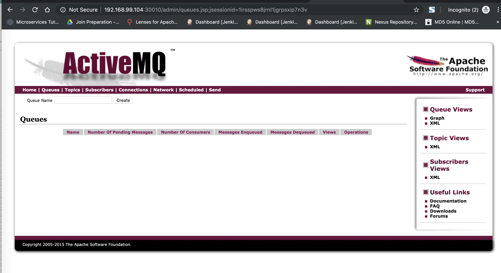

```
localhost:doc3 zhao$ pwd
/Users/zhao/dev/doc3
localhost:doc3 zhao$ kubectl apply -f .
pod/webapp unchanged
pod/webapp-release-0-5 unchanged
pod/queue created
service/fleetman-webapp unchanged
service/fleetman-queue created
localhost:doc3 zhao$ kubectl apply -f .
pod/webapp unchanged
pod/webapp-release-0-5 unchanged
pod/queue unchanged
service/fleetman-webapp unchanged
service/fleetman-queue unchanged
localhost:doc3 zhao$ kubectl get all
NAME                     READY   STATUS    RESTARTS   AGE
pod/queue                1/1     Running   0          55s
pod/webapp               1/1     Running   3          6d
pod/webapp-release-0-5   1/1     Running   1          4d


NAME                      TYPE        CLUSTER-IP      EXTERNAL-IP   PORT(S)          AGE
service/fleetman-queue    NodePort    10.101.245.41   <none>        8161:30010/TCP   55s
service/fleetman-webapp   NodePort    10.104.2.249    <none>        80:30080/TCP     5d
service/kubernetes        ClusterIP   10.96.0.1       <none>        443/TCP          9d


localhost:doc3 zhao$ kubectl describe pod queue
Name:         queue
Namespace:    default
Node:         minikube/10.0.2.15
Start Time:   Mon, 08 Jul 2019 12:42:41 -0400
Labels:       app=queue
Annotations:  kubectl.kubernetes.io/last-applied-configuration:
                {"apiVersion":"v1","kind":"Pod","metadata":{"annotations":{},"labels":{"app":"queue"},"name":"queue","namespace":"default"},"spec":{"conta...
Status:       Running
IP:           172.17.0.6
Containers:
  queue:
    Container ID:   docker://f6f5c385fed3f254080967aa195e1b73c549e01d90d705b24cc95edceb181075
    Image:          richardchesterwood/k8s-fleetman-queue:release1
    Image ID:       docker-pullable://richardchesterwood/k8s-fleetman-queue@sha256:bc2cb90a09aecdd8bce5d5f3a8dac17281ec7883077ddcfb8b7acfe2ab3b6afa
    Port:           <none>
    Host Port:      <none>
    State:          Running
      Started:      Mon, 08 Jul 2019 12:43:18 -0400
    Ready:          True
    Restart Count:  0
    Environment:    <none>
    Mounts:
      /var/run/secrets/kubernetes.io/serviceaccount from default-token-tfnvs (ro)
Conditions:
  Type           Status
  Initialized    True
  Ready          True
  PodScheduled   True
Volumes:
  default-token-tfnvs:
    Type:        Secret (a volume populated by a Secret)
    SecretName:  default-token-tfnvs
    Optional:    false
QoS Class:       BestEffort
Node-Selectors:  <none>
Tolerations:     node.kubernetes.io/not-ready:NoExecute for 300s
                 node.kubernetes.io/unreachable:NoExecute for 300s
Events:
  Type    Reason                 Age   From               Message
  ----    ------                 ----  ----               -------
  Normal  Scheduled              88s   default-scheduler  Successfully assigned queue to minikube
  Normal  SuccessfulMountVolume  88s   kubelet, minikube  MountVolume.SetUp succeeded for volume "default-token-tfnvs"
  Normal  Pulling                88s   kubelet, minikube  pulling image "richardchesterwood/k8s-fleetman-queue:release1"
  Normal  Pulled                 51s   kubelet, minikube  Successfully pulled image "richardchesterwood/k8s-fleetman-queue:release1"
  Normal  Created                51s   kubelet, minikube  Created container
  Normal  Started                51s   kubelet, minikube  Started container
localhost:doc3 zhao$ minikube ip
There is a newer version of minikube available (v1.2.0).  Download it here:
https://github.com/kubernetes/minikube/releases/tag/v1.2.0

To disable this notification, run the following:
minikube config set WantUpdateNotification false
192.168.99.104
localhost:doc3 zhao$
```

open http://192.168.99.104:30010/ in browser

username/password: admin/admin


