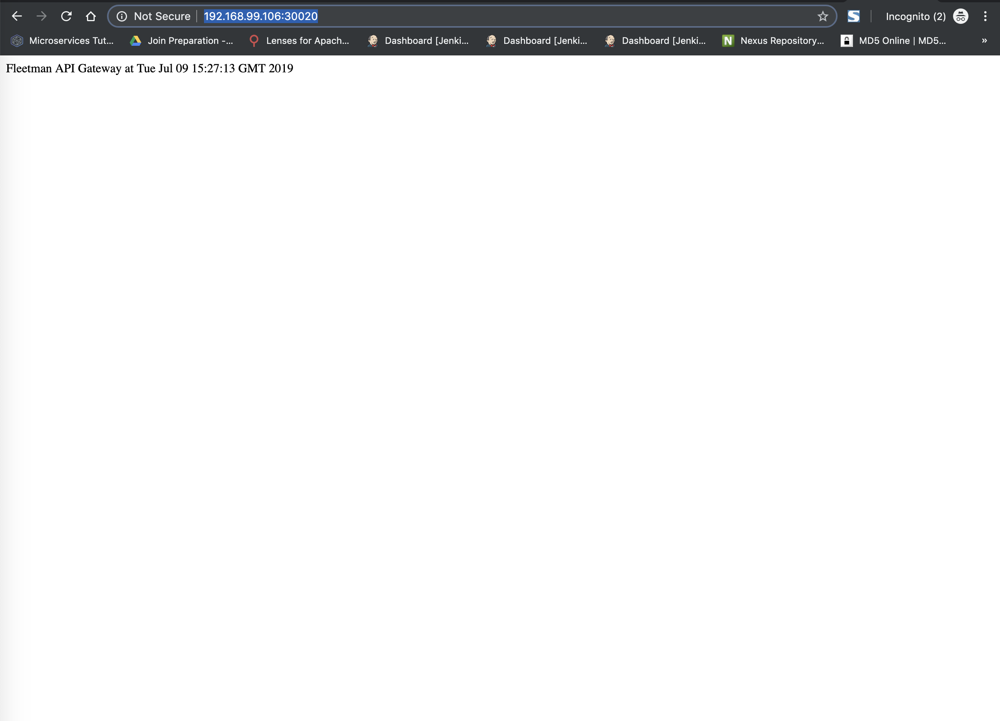
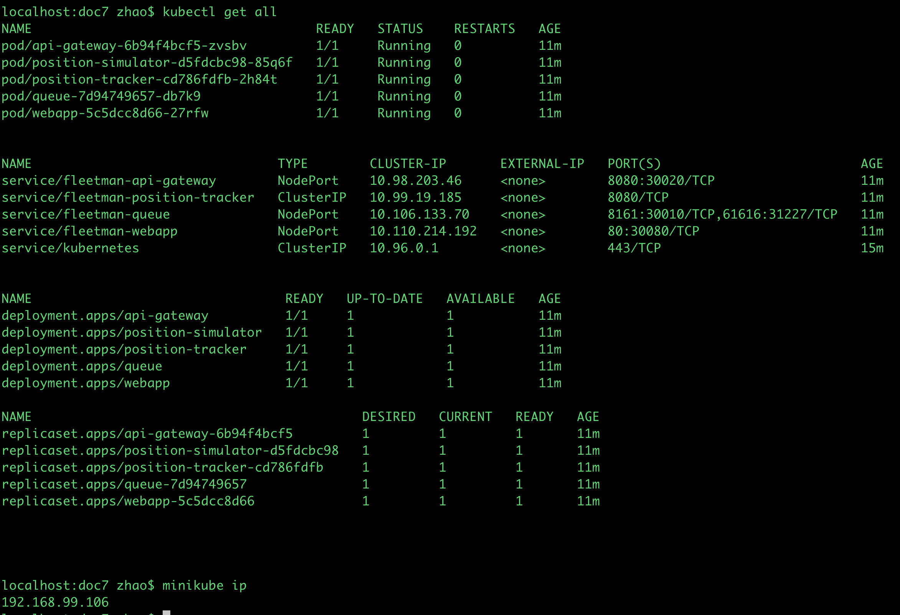

```
localhost:~ zhao$ rm -rf ~/.kube/
localhost:~ zhao$ rm -rf ~/.minikube
localhost:~ zhao$ brew cask install minikube
localhost:doc7 zhao$ minikube start --memory 4096
localhost:doc7 zhao$ ls
readme.md	services.yaml	workloads.yaml
localhost:doc7 zhao$ kubectl apply -f workloads.yaml
deployment.apps/queue created
deployment.apps/position-simulator created
deployment.apps/position-tracker created
deployment.apps/api-gateway created
deployment.apps/webapp created
localhost:doc7 zhao$ kubectl apply -f services.yaml
service/fleetman-webapp created
service/fleetman-queue created
service/fleetman-position-tracker created
service/fleetman-api-gateway created
localhost:doc7 zhao$ minikube ip
192.168.99.106
localhost:doc7 zhao$ kubectl get all
NAME                                     READY   STATUS              RESTARTS   AGE
pod/api-gateway-6b94f4bcf5-zvsbv         0/1     ContainerCreating   0          50s
pod/position-simulator-d5fdcbc98-85q6f   0/1     ContainerCreating   0          50s
pod/position-tracker-cd786fdfb-2h84t     1/1     Running             0          50s
pod/queue-7d94749657-db7k9               1/1     Running             0          50s
pod/webapp-5c5dcc8d66-27rfw              0/1     ContainerCreating   0          50s


NAME                                TYPE        CLUSTER-IP       EXTERNAL-IP   PORT(S)                          AGE
service/fleetman-api-gateway        NodePort    10.98.203.46     <none>        8080:30020/TCP                   37s
service/fleetman-position-tracker   ClusterIP   10.99.19.185     <none>        8080/TCP                         37s
service/fleetman-queue              NodePort    10.106.133.70    <none>        8161:30010/TCP,61616:31227/TCP   37s
service/fleetman-webapp             NodePort    10.110.214.192   <none>        80:30080/TCP                     37s
service/kubernetes                  ClusterIP   10.96.0.1        <none>        443/TCP                          5m7s


NAME                                 READY   UP-TO-DATE   AVAILABLE   AGE
deployment.apps/api-gateway          0/1     1            0           50s
deployment.apps/position-simulator   0/1     1            0           50s
deployment.apps/position-tracker     1/1     1            1           50s
deployment.apps/queue                1/1     1            1           50s
deployment.apps/webapp               0/1     1            0           50s

NAME                                           DESIRED   CURRENT   READY   AGE
replicaset.apps/api-gateway-6b94f4bcf5         1         1         0       50s
replicaset.apps/position-simulator-d5fdcbc98   1         1         0       50s
replicaset.apps/position-tracker-cd786fdfb     1         1         1       50s
replicaset.apps/queue-7d94749657               1         1         1       50s
replicaset.apps/webapp-5c5dcc8d66              1         1         0       50s
```


** frontend: http://192.168.99.106:30080/
** queue: http://192.168.99.106:30010/admin/queues.jsp
** gateway: http://192.168.99.106:30020/





